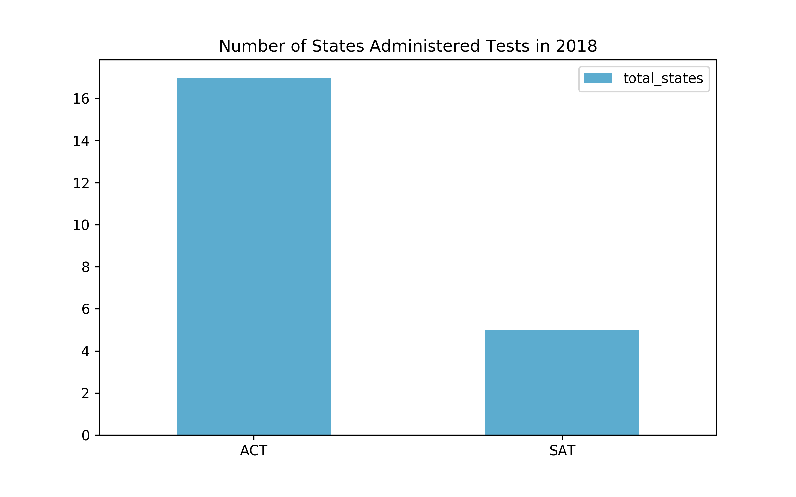
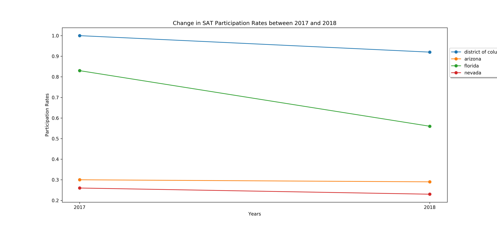
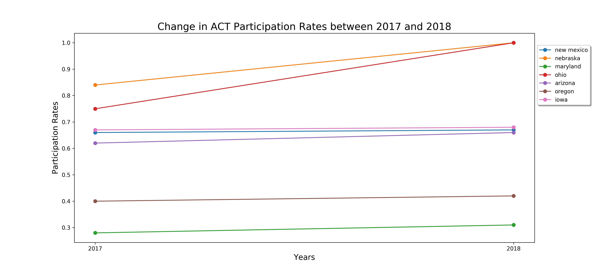
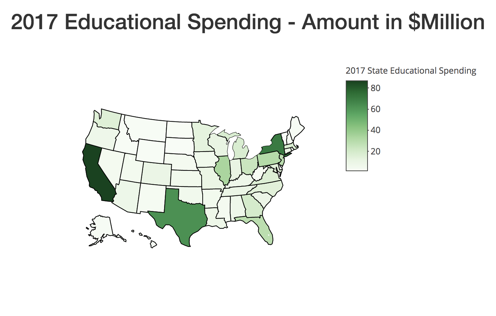

# Project 1: Standardized Testing, Statistical Summaries and Inference

### Executive Summary

In this project, I explored aggregate SAT and ACT scores and participation rates from each state in the United States. I was curious to identify trends in the data that might help the College Board understand the motivations of why a student or state chooses the SAT vs. the ACT. I thought the provided dataset would be interesting to compare with the educational budgets for each state. I pulled in data from the [U.S. Census Bureau](https://www.census.gov/programs-surveys/school-finances.html) to see how much each state was spending in 2017. The most recent data available is from 2017.

---

### Problem Statement
Millions oft students prepare for college across the country each year. Given the choice students have between which college admissions test to take, how might we increase statewide participation in the SATs in the nextcouple of years?

---

### Data

#### Provided Data

For this project, we were provided with four datasets:

- [2017 SAT Scores](./data/sat_2017.csv)
- [2017 ACT Scores](./data/act_2017.csv)
- [2018 SAT Scores](./data/sat_2018.csv)
- [2018 ACT Scores](./data/act_2018.csv)

These data give average SAT and ACT scores by state, as well as participation rates, for the graduating class of 2017. Source for the SAT data [here](https://blog.collegevine.com/here-are-the-average-sat-scores-by-state), and the source for the ACT data [here](https://blog.prepscholar.com/act-scores-by-state-averages-highs-and-lows). 

#### Additional Data

In addition to the provided data, I brought in state educational spending data.

- [2017 State Educational Spending](./code/chloropleth/data/states_budget_gov.csv)
- [State Abbreviations](./code/chloropleth/data/states.csv)

The 2017 State Educational Spending data includes the state-by-state total elementary-secondary expenditure in 2017. The source is the U.S. Census Bureau provided [here](https://www.census.gov/programs-surveys/school-finances.html). The States Abbreviations data includes the state names and their abbreviations. This was used for mapping data in the chloropleths below. Source of this data provided [here](http://worldpopulationreview.com/states/state-abbreviations). 

#### Description of Data

|Feature|Type|Test|Description|
|:---|---|---|:---|
|state                     | object||State names|
|act_participation_2017    |float64|ACT|Percent of students in the the class of 2017 who took the ACT|
|act_english_2017          |float64|ACT|State average in English|
|act_math_2017             |float64|ACT|State average in Math|
|act_reading_2017          |float64|ACT|State average in Reading|
|act_science_2017          |float64|ACT|State average in Science|
|act_composite_2017        |float64|ACT|State average Composite score| 
|act_participation_2018    |float64|ACT|Percent of students in the the class of 2018 who took the ACT|
|act_composite_2018        |float64|ACT|State average Composite score| 
|sat_participation_2017    |float64|SAT|Percent of students in the the class of 2017 who took the SAT|
|sat_verbal_2017                 |int64|SAT|State average in Reading and Writing|
|sat_math_2017               |int64|SAT|State average in Math|
|sat_total_2017              |int64|SAT|State average Total score|
|sat_participation_2018    |float64|SAT|Percent of students in the the class of 2018 who took the SAT|
|sat_verbal_2018                 |int64|SAT|State average in Reading and Writing|
|sat_math_2018               |int64|SAT|State average in Math|
|sat_total_2018              |int64|SAT|State average Total score|
|act_participation_change|float64|ACT|Change in participation rates from 2017 to 2018|
|sat_participation_change|float64|SAT|Change in participation rates from 2017 to 2018|

### Exploring the Data

The data cleaning and exploratory work was completed in python [here](./code/starter-code.ipynb).

#### What's the participation rate for SAT in 2017 and 2018?
To get a baseline understanding of the data, I started with a series of exploratory graphs. To orient around the problem statement specifically, I wanted to first understand what the current participation rates are for the SATS.

Here's a visual map of SAT participation rates in 2017. The darker purple represents 100% participation rate in that state. 100% participation rates are achieved when states mandate this test.

In comparison, here are the participation rates in 2018. 

These maps were created using [Potly](https://plot.ly) in R. Code for the chloropleth maps can be seen [here](./code/chloropleth).

#### How does this compare to the ACTs?

Looking at the two maps above, it looks like SAT participation rates have increased in 2018 for some states. I was curious to see how this compared to the ACTs. I wanted to know which states mandated the ACTs vs. SATs in 2018.

In 2018, 17 states mandated the ACTs compare to 5 states that mandated the SATs. This is an area that the College Board may be interested in getting more states to sponsor the SATs.

---

### Primary findings and recommendations

#### Recommendation 1: Focus on states that had a drop in SAT participation rates between 2017 and 2018

One recommendation would be to focus and monitor states that had a drop in SAT participation rates between 2017 and 2018.

By monitoring these states, we can try to answer what led to the drop in participation rates? How might we design an intervention to reverse this trend, and prevent it from happening in other states? 

#### Recommendation 2: Look into states that had an increase in ACT participation rates between 2017 and 2018

Alternatively, we can look at states that increased in ACT participation rates between 2017 and 2018. By understanding what motivated this increase, we can observe if other states might be heading towards this direction and design strategies to intervene. 

#### Recommendation 3: Look at state educational budgets 

Lastly, we should look at the state budgets for education spending to get a sense of which states might be able to afford to mandate the test. Explore an interactive version of this map [here].(https://veeps.shinyapps.io/project_1)

Looking at this map, California and Texas might also be of interest because they have the highest budgets on education and low SAT participation rates.

This map was also created using Plotly in R. Code for merging the SAT, ACT, and Census data can be found [here](./code/chloropleth/merge_tables.r). The final dataset is [here](./data/final_chloropleth.csv). Code for the map can be found [here](./app.r). Because it was published on Shinyapps.io, the rsconnect folder can be found [here](./rsconnect).

#### Summary of states to focus on

- Nevada
- Arizona
- Florida
- California
- Texas

---

### Next Steps

Here are some next steps to improve the recommendations on this project:

- Compare the state spending budget with student population data. I imagine that a state budget is high because they have a high student population. The budget data provided is surface level, and is not indicative of whether or not the state can afford to mandate the test for all their students.
- Get hisotircal data on participation rates and try to train a model to see which features might be correlated with participation rates.
- Monitor how the 2020 ACT online version of the test affects participation rates. Is this a cost saving, and perhaps time saving, factor that the SATs should invest in?